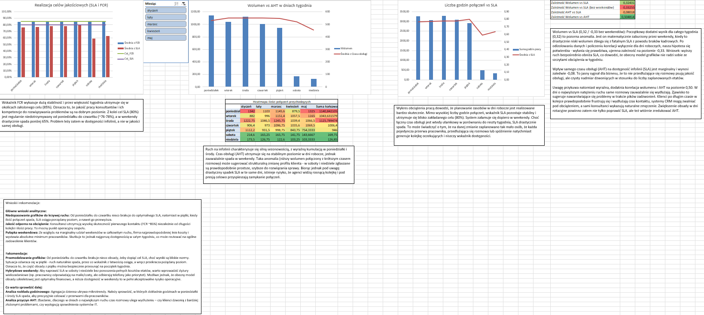

# 📞 Contact Center Performance & Operations Analysis

## 📌 Project Overview
This project is based on an analytical assessment (recruitment task) for a Data Analyst role. The objective was to analyze operational data from an inbound Contact Center, visualize trends, evaluate performance against key KPIs, and formulate actionable business recommendations.

**Key Operational Targets:**
*   **FCR** (First Contact Resolution): **85%**
*   **SLA** (Service Level Agreement): **80%**

## 🛠️ Tools & Techniques
*   **Microsoft Excel:** Pivot Tables, Advanced Charting, Conditional Formatting (Heatmaps), Statistical Analysis (Correlation).
*   **Analytical Skills:** Trend Analysis, Resource Planning Assessment, Business Recommendations.

## 📊 Dashboard Preview
*(The full interactive `.xlsx` file is available in this repository)*

## 💡 Key Analytical Insights

Based on the data and correlation models, I identified several operational patterns:

*   **Quality is Resilient to Workload (FCR Stability):** Consultants maintain a high First Contact Resolution rate (~85%) regardless of queue length and workload volume. This is a strong operational point for the team.
*   **Schedule vs. Traffic Mismatch:** There is a noticeable understaffing from Monday to Thursday, causing the SLA to drop below target (~76-78%). Conversely, on Fridays, when call volume naturally decreases, the SLA easily hits and exceeds the target.
*   **The Weekend Trap:** Due to a marginal share of total traffic on weekends, the company likely cuts costs by using an absolute minimum skeleton crew. However, this results in drastically poor availability (SLA drops <65%), which can negatively impact overall customer satisfaction.
*   **Volume vs. AHT Correlation:** There is a strong positive correlation (0.50) between call volume and Average Handling Time (AHT). On peak days (like Mondays), calls take longer. This suggests that during heavy traffic, either the CRM systems slow down under load, or consultants experience natural fatigue.

## 🚀 Business Recommendations

To optimize operations and achieve the target 80% SLA consistently, I recommend the following actions:

1.  **Shift Schedule Remodeling:** Shift a portion of the workforce from Friday (which is overstaffed relative to traffic) to the beginning of the week (Monday-Thursday) to patch the SLA gaps safely.
2.  **Hybrid Weekends:** To fix weekend SLA without incurring the full cost of dedicated inbound staff, introduce multi-tasking shifts. Employees could handle back-office tasks, emails, or chats, while treating incoming phone calls as an absolute priority.
3.  **Hourly Distribution Analysis:** Daily aggregation hides micro-trends. I recommend conducting an hourly analysis for Mondays and Wednesdays to precisely target staff breaks during traffic dips.
4.  **AHT Root Cause Analysis:** Investigate why talk time increases on the busiest days—specifically, whether clients call with more complex issues after the weekend, or if IT system lags are slowing down consultants.
