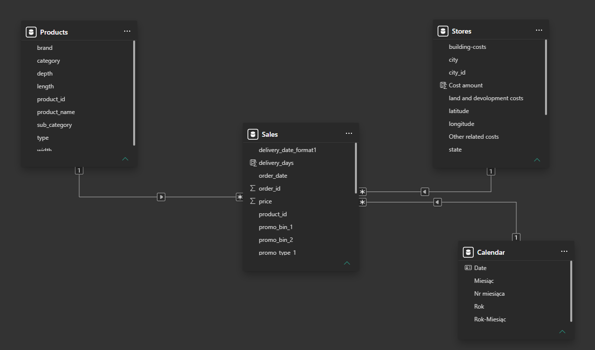
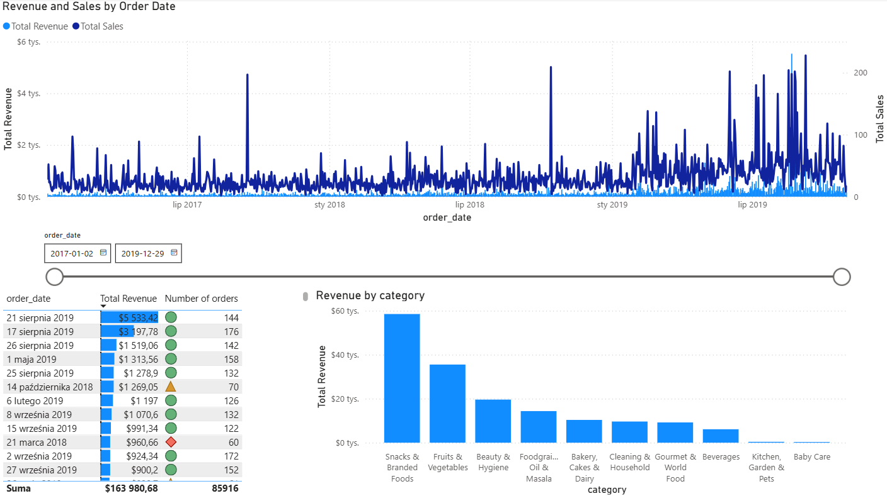
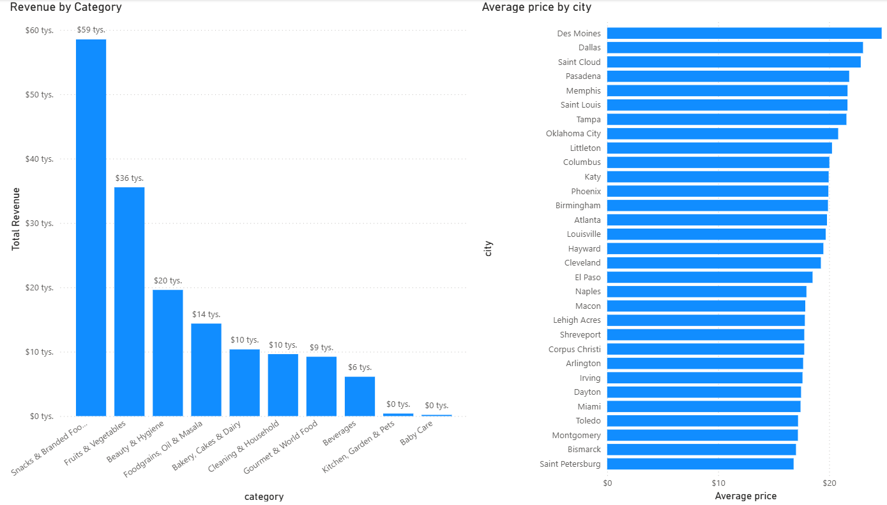
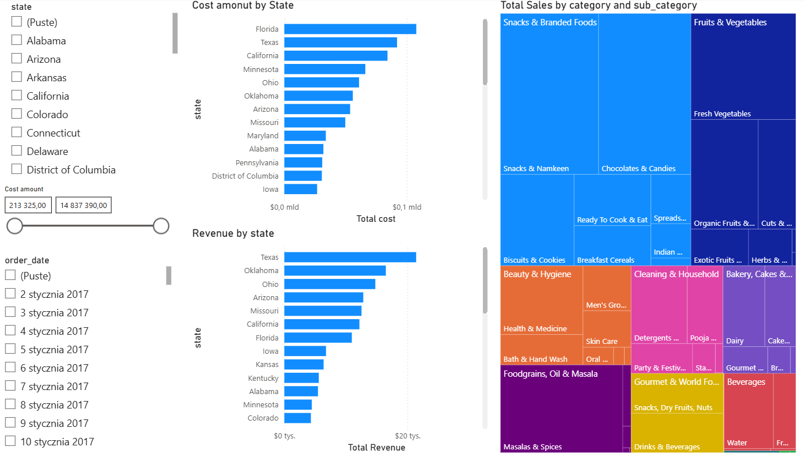
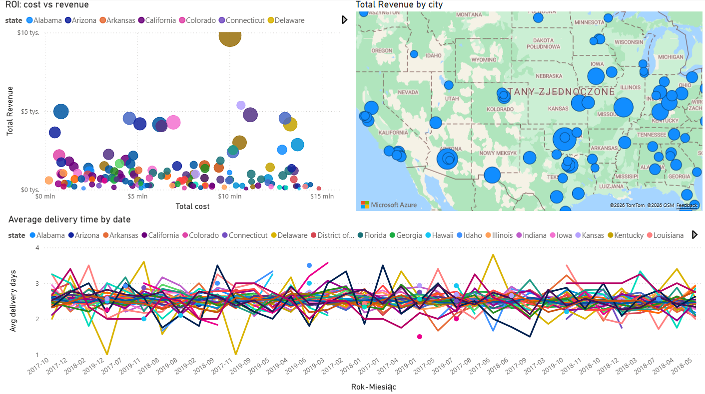
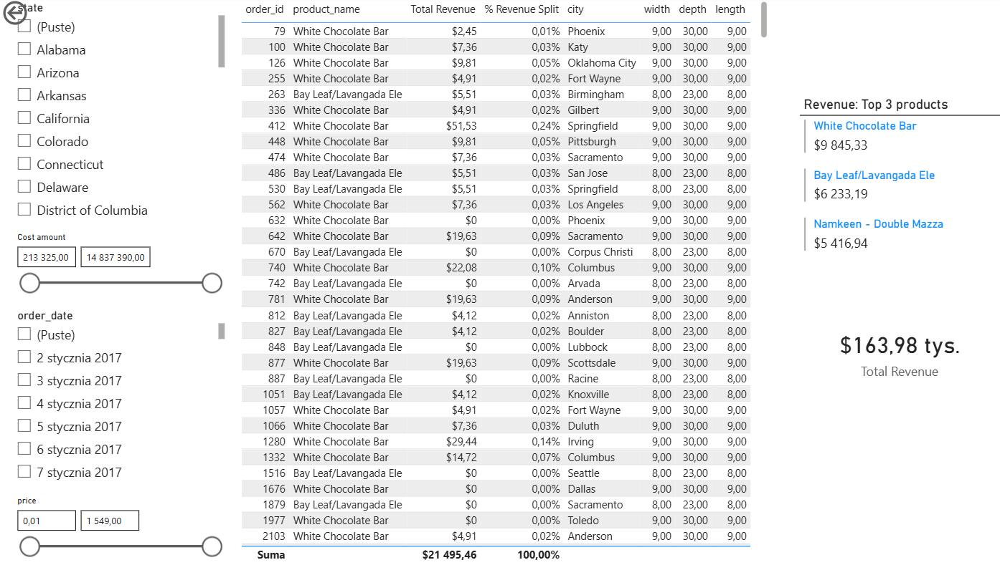

# 🛒 E-Commerce Sales & Operations Dashboard (Power BI)

## 📌 Project Overview
This project showcases a comprehensive End-to-End Business Intelligence solution. The goal was to analyze 3 years of e-commerce sales, operational costs, and logistics data. The primary challenge was extracting and transforming highly unorganized, messy raw data files into a structured, performant data model to generate actionable geospatial and revenue insights.

## 🛠️ Tools & Technologies
*   **Power BI Desktop**
*   **Power Query (M):** Complex Data Cleaning, ETL processes.
*   **DAX:** Data modeling, creating custom measures and KPIs, Time Intelligence.
*   **Data Modeling:** Star Schema design.

## 🧹 Data Preparation (ETL Process)
The raw dataset consisted of 6 unnormalized files (CSV/Excel) that required heavy transformation in Power Query before any visualization could take place:
1.  **Appending Historical Data:** Merged messy sales logs from 2017 (which contained corrupted headers and metadata) with standardized 2018 and 2019 datasets.
2.  **String Parsing & Delimiter Splitting:** Extracted Product Categories and Sub-categories from single concatenated strings. Parsed complex geographic data (splitting state, abbreviation, and city).
3.  **Data Type & Formatting Fixes:** Handled encoding issues (`latin1`), corrected text spacing/tabs in brand names, and standardized date formats.

---

## 🗄️ Data Model (Star Schema)
To ensure optimal performance and DAX filter propagation, I designed a standard Star Schema connecting the central `Sales` fact table with dimensions: `Products`, `Stores`, and a custom `Calendar` table.

---

## 📊 Dashboard Visualizations & Key Insights

The dashboard was designed to provide both high-level overviews and granular drill-downs into the company's performance.

### 1. Sales Trends & Time Analysis
This view focuses on temporal patterns and overall revenue generation over the 3-year period.
*   **What it shows:** A dense line chart comparing Total Revenue vs. Total Sales over time, revealing extreme seasonal spikes. The table below utilizes conditional formatting (traffic light icons) to instantly flag high and low-performing days. 
*   **Insight:** The business relies heavily on specific, highly concentrated sales events (e.g., aggressive promotions), as daily sales are otherwise relatively flat.

### 2. Revenue Drivers & Geographical Pricing
This section breaks down financial performance by product groups and geographical locations.
*   **What it shows:** A column chart identifying top categories and a bar chart detailing the average product price across different cities.
*   **Insight:** "Snacks & Branded Foods" and "Fruits & Vegetables" are the absolute core of the business. Additionally, the average price varies significantly by city (e.g., Des Moines has the highest average price), which could inform localized pricing strategies.

### 3. Operational Costs vs. Sales Hierarchy
A structural breakdown of expenses and categorical sales volume.
*   **What it shows:** A side-by-side comparison of Cost Amount by State versus Revenue by State, paired with a hierarchical Treemap of Total Sales by Category and Sub-category.
*   **Insight:** Texas and Florida are the most expensive states to operate in (highest land/building costs). However, Texas translates this cost into the highest revenue, whereas Florida's revenue generation is disproportionately low compared to its high costs.

### 4. Geospatial ROI & Logistics
An advanced overview of geographical performance and supply chain efficiency.
*   **What it shows:** A Map visual for revenue distribution, a Scatter Plot (Bubble chart) correlating Total Cost vs. Total Revenue by state, and a line chart tracking average delivery days.
*   **Insight:** The Scatter plot clearly isolates outliers—states with high costs but low revenue (bubbles on the far right, low on the Y-axis). The delivery time analysis shows dynamic fluctuations between 1.5 and 3.5 days, highlighting potential logistical bottlenecks across different states.

### 5. Product-Level Performance (Top Sellers)
A highly granular view for inventory and catalog management.
*   **What it shows:** A detailed matrix calculating the `% Revenue Split` for individual transactions and physical product dimensions. Custom KPI cards highlight the Top 3 best-selling products overall.
*   **Insight:** Products like "White Chocolate Bar" and "Bay Leaf/Lavangada Ele" are top performers. The inclusion of physical dimensions (width, depth, length) alongside sales data is crucial for warehouse optimization and shelf-space planning.

