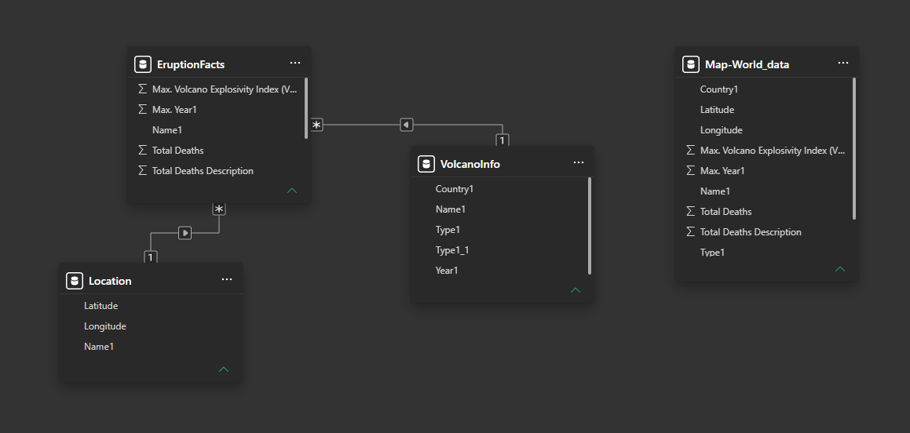
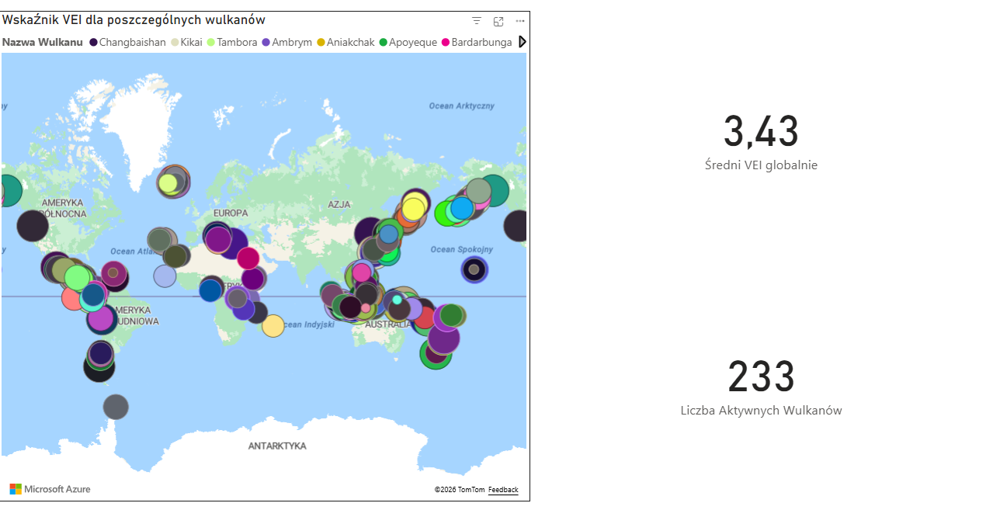
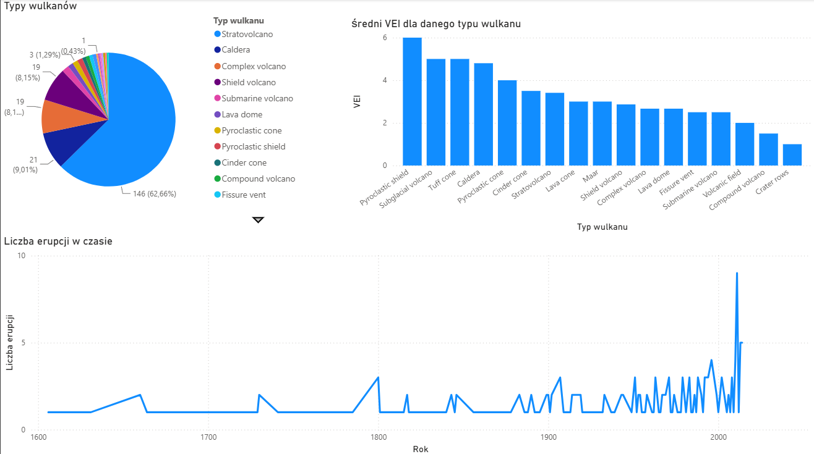
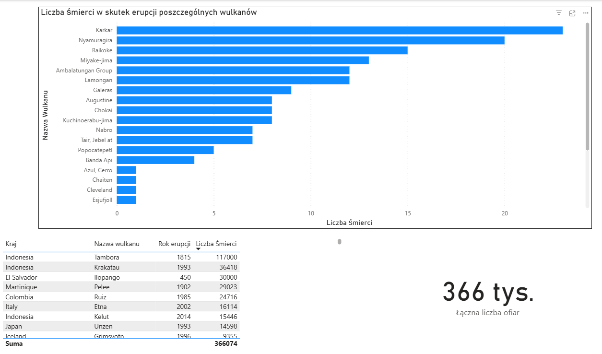

# 🌋 Global Volcanic Eruptions & Hazards Analysis (Power BI)

## 📌 Project Overview
This project explores a comprehensive historical database of global volcanic eruptions (sourced from Kaggle). The objective was to analyze geological patterns, assess the Volcanic Explosivity Index (VEI), map active hazard zones, and quantify the historical human impact (fatalities) caused by these devastating natural events.

## 🌊 The Challenge: Navigating a Sea of Chaotic Data (ETL)
Working with this dataset felt like navigating a turbulent, uncharted ocean of historical records. The raw data spanned millennia and was fraught with inconsistencies: 
*   Incomplete coordinates and fragmented geographical mapping.
*   Missing historical fatality records (Null values mixed with text descriptions).
*   Inconsistent naming conventions for volcano types and varying VEI scales.

**The Solution:** Using **Power Query**, I acted as the navigator—cleansing the data, standardizing the text formats, imputing logical values for missing records, and extracting precise geospatial coordinates. I successfully anchored this wild dataset into a structured, relational model, transforming raw geological history into a clear, interactive BI dashboard.

## 🛠️ Tools & Technologies
*   **Power BI:** Data Visualization & Interactive Dashboarding.
*   **Power Query (M):** Deep Data Cleansing, Transformation, and formatting.
*   **DAX:** Creating measures for total fatalities, average VEI, and active volcano counts.
*   **Data Modeling:** Relational database structuring.

---

## 🗄️ Data Model
To bring order to the chaos, I constructed a relational data model separating the core facts from dimensional attributes. The model connects `EruptionFacts` (metrics like max VEI, total deaths) with dimensions such as `VolcanoInfo` (morphology, type) and `Location` (geospatial coordinates).

---

## 📊 Dashboard Visualizations & Key Insights

### 1. Global Hazard Mapping & Activity
This geographical view provides a macro-perspective on global volcanic threats.
*   **What it shows:** An Azure Map plotting the coordinates of 233 active volcanoes, dynamically sized by their magnitude. Custom KPI cards display the global average Volcanic Explosivity Index (VEI).
*   **Insight:** The visualization clearly traces the "Ring of Fire" around the Pacific Ocean. An average global VEI of 3.43 indicates a moderately high baseline of explosive potential, meaning that a typical recorded eruption has significant local, if not regional, impact.

### 2. Eruption Morphology & Historical Timeline
An analysis of volcano types, their respective explosive power, and the frequency of eruptions over centuries.
*   **What it shows:** A Pie Chart of volcano classifications, a Bar Chart ranking the average VEI by volcano type, and a Line Chart tracking recorded eruptions from the 1600s to the present day.
*   **Insight:** Stratovolcanoes are by far the most common type (~62%), but Pyroclastic Shields and Subglacial volcanoes produce the most violent eruptions on average (VEI 5.0 - 6.0). The dramatic spike in the line chart during the 19th and 20th centuries likely reflects advancements in historical record-keeping and global communication, rather than a sudden geological awakening.

### 3. Human Impact & Fatalities
A sobering look at the deadliest eruptions in human history.
*   **What it shows:** A horizontal Bar Chart ranking individual volcanoes by the number of fatalities, accompanied by a detailed matrix displaying specific eruption years, locations, and death tolls. A prominent KPI card shows the aggregate historical death toll (over 366k).
*   **Insight:** A small fraction of eruptions is responsible for the vast majority of historical deaths. For instance, the 1815 Tambora eruption (Indonesia) alone accounts for nearly 1/3 of all recorded fatalities (117,000 deaths). This data highlights the critical need for continued investment in early warning systems in high-risk zones like Indonesia and Central America.

